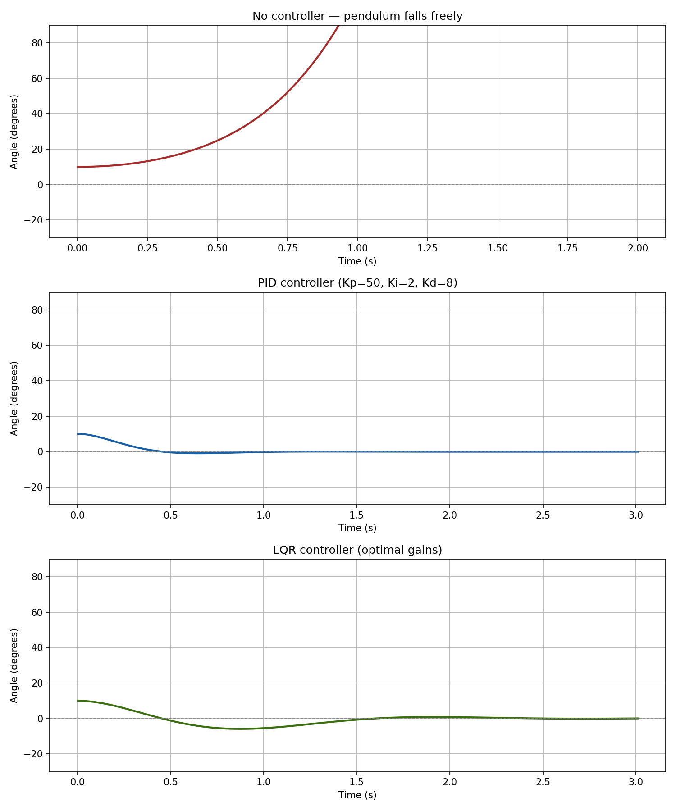

# Self-Balancing Robot

A two-wheeled self-balancing robot built on an Adafruit Metro M0 Express, 
implementing and comparing PID and LQR control strategies.

---

## Project stages

| Stage | Description | Status |
|-------|-------------|--------|
| 1 | Physics simulation — PID and LQR comparison in Python | ✅ Complete |
| 2 | IMU sensor integration — MPU-6050 angle estimation on Metro M0 | 🔜 Next |
| 3 | Closed-loop control — PID running on real hardware | ⬜ Planned |
| 4 | LQR on hardware + tuning | ⬜ Planned |

---

## Stage 1 — Simulation results

The simulation models the full nonlinear dynamics of a cart-pendulum system
and compares three scenarios: no control, PID, and LQR.



### What the plots show
- **No controller** — starting from 10°, the pendulum falls to 90° in under 1 second
- **PID** — manually tuned gains (Kp=50, Ki=2, Kd=8) stabilize the angle with some oscillation
- **LQR** — optimal gains computed via the algebraic Riccati equation, 
  faster settling and less overshoot than PID

### Key insight
PID requires manual gain tuning by feel. LQR takes a cost matrix expressing 
your priorities (Q penalizes state error, R penalizes control effort) and 
computes the mathematically optimal gains automatically. The tradeoff: LQR 
requires an accurate system model.

---

## Hardware

| Component | Part |
|-----------|------|
| Microcontroller | Adafruit Metro M0 Express |
| IMU | MPU-6050 GY-521 (I2C) |
| Motor driver | TB6612FNG |
| Motors | TT DC gear motors x2 |
| Power | 7.4V LiPo battery |

---

## Software dependencies

```bash
pip install numpy matplotlib scipy
```

Run the simulation:

```bash
python simulation.py
```

---

## Concepts covered

- Nonlinear dynamics of an inverted pendulum (Lagrangian mechanics)
- PID control — proportional, integral, derivative terms
- State-space representation — A and B matrices
- LQR optimal control — algebraic Riccati equation, Q/R cost matrices
- Complementary filter for IMU sensor fusion *(Stage 2)*
- CircuitPython on ARM Cortex-M0 *(Stage 2)*

---

## Author

Ilias — EE undergraduate / incoming Robotics MS student